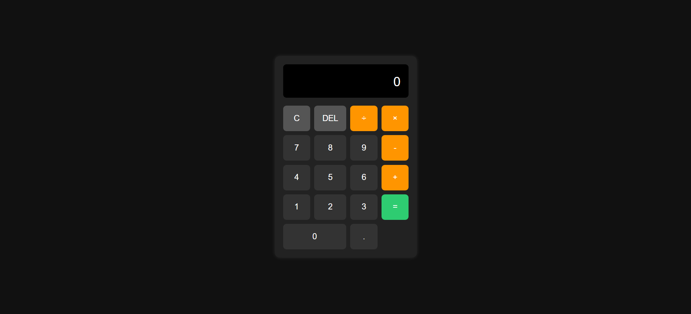

# React Calculator

A simple, clean, and responsive web-based calculator built using React.
This project was created as a practice exercise to understand React fundamentals, component structure, and separation of logic using custom hooks.

# ScreenShot

# Project Structure
- App.jsx: Connects logic + UI.
- useCalculator.jsx (Hooks Folder): Contains all calculator logic in one clean place.
- Components: Pure UI (display, button, ButtonGrid).

# What i learned
1. Component-Based Architecture
I learned how to break UI into small reusable components:
- Display
- Button
- ButtonGrid
This makes code cleaner and easier to maintain.

2. Using React Hooks Effectively
i used :
- useState → storing current number, previous number, and selected operation.
- useCallback → optimizing functions and preventing unnecessary re-renders.
- Custom hooks → separating business logic from UI.

3. Separating Logic From UI
All calculator logic (number input, operations, delete, clear, calculate) is inside a custom hook useCalculator.jsx.
This makes:
- App.jsx clean
- Components reusable
- Logic easier to debug

4. Managing Multiple States Together
I practiced handling multiple related states:
- current
- previous
- operation
And managing situations like:
- chaining operations (5 + 5 + 5)
- preventing multiple decimals
- handling division by zero → show “Error”
5. Building a Responsive UI
I learned to use:
- CSS Grid for button layout
- Flexbox for the display
- Styling dark mode UI
- Creating modern button interactions (hover, colors, spacing)

# Installation
git clone https://github.com/jordanryanoFA/portfolio/calculator.git
cd calculator
npm install
npm run dev
