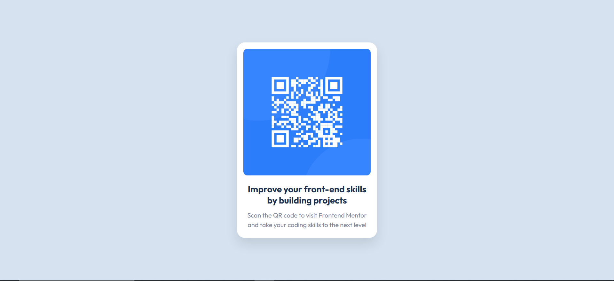

# QR Code Component

This project is a solution to the [QR Code Component Challenge](https://www.frontendmentor.io/challenges/qr-code-component-iux_sIO_H) from **Frontend Mentor**.  
The goal of the challenge is to build a visually accurate QR card using semantic HTML and responsive CSS while matching the provided design.

---

## 🧠 What I Learned

This practice helped improve:

- Writing clean and semantic HTML structure
- Using a mobile-first layout approach
- Centering elements with CSS Flexbox
- Using CSS variables for consistent design tokens
- Applying border-radius, shadows, and font styling to match UI designs
- Making a small UI component responsive without unnecessary complexity

---

## 📁 Built With

- Semantic HTML5
- CSS3 (Flexbox + Responsive Media Queries)
- Google Fonts (Outfit)
- Mobile-first workflow

---

## 🚀 Preview

| Desktop View | Mobile View |
|-------------|-------------|
| 🌐 1440px   | 📱 375px     |

> The layout adjusts smoothly based on screen size.

---

## 📸 Screenshot



---

## 🧩 How to Run Locally

```bash
git clone https://github.com/jordanryanoFA/portfolio/qr-code-component-main.git
cd qr-code-component-main
open index.html
